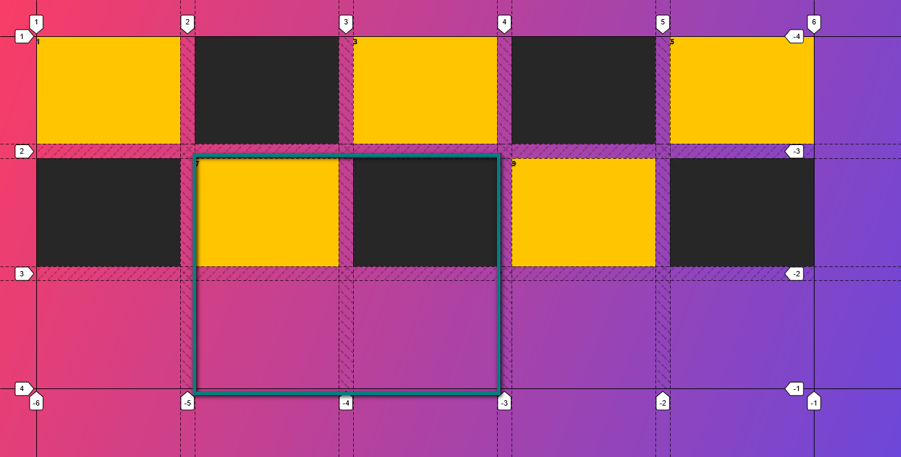
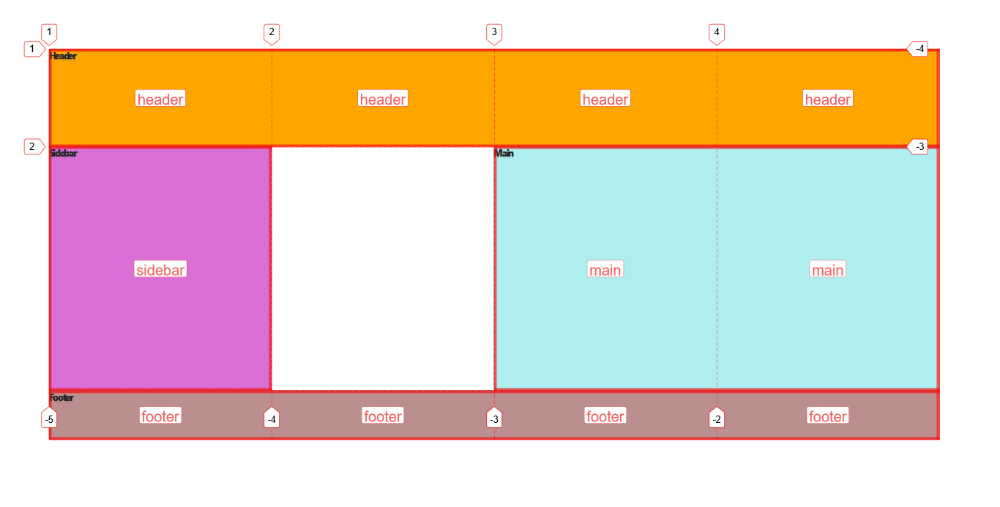
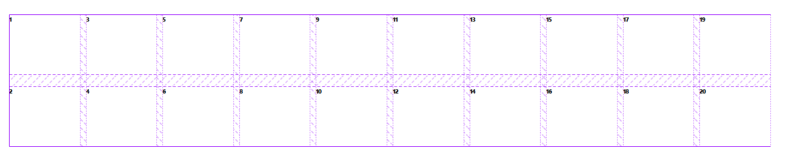
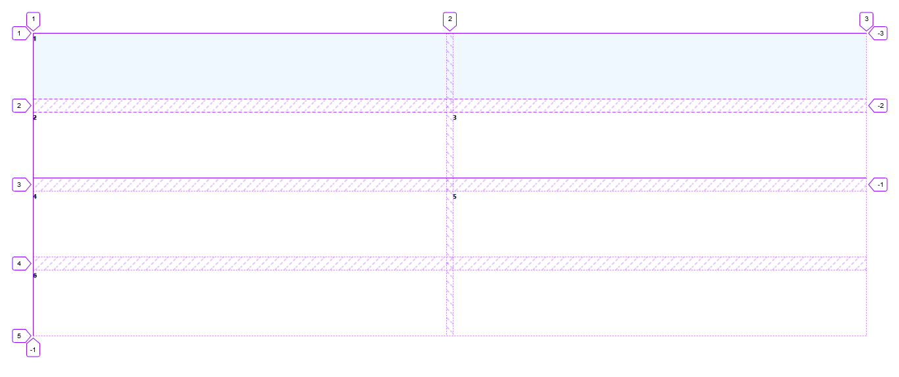

# CSS Grid

CSS Grid Layout is the most powerful layout system available in CSS. It is a 2-dimensional system, meaning it can handle both columns and rows, unlike flexbox which is largely a 1-dimensional system. You work with Grid Layout by applying CSS rules both to a parent element (which becomes the Grid Container) and to that element’s children (which become Grid Items).

## Terminology

-   ### `Grid container`

The container that holds the entire CSS grid. It will be the element that has thedisplay: grid or display: inline-grid property on it.

```css
.container {
	display: grid;
	grid-template-columns: repeat(5, 200px);
	grid-template-rows: repeat(3, 150px);
	grid-gap: 20px;
}
```

-   ### `Grid item`

Any element that is a direct child of a grid container.

-   ### `Grid Line`

The dividing lines that make up the structure of the grid. They can be either vertical (“column grid lines”) or horizontal (“row grid lines”) and reside on either side of a row or column.


The above image red part show (grid line along column) and green part show (grid line along rows). And those number shows no. of grid lines along axis.

-   ### `Grid Track`

The space between two adjacent grid lines. You can think of them like the columns or rows of the grid.


-   ### `Grid Cell`

A single unit of a CSS grid.


-   ### `Grid Area`

Rectangular space surrounded by four grid lines. A grid area can contain any number of grid cells.



-   ### `Grid Row`

A horizontal track of a grid.


-   ### `Grid Column`

A vertical track of a grid.


-   ### `Gutter`

The space between rows and columns in a grid.


---

## Properties for Parent (Grid Container)

Let see each properties and what they do

-   ### `display: grid;`

Defines the element as a grid container and establishes a new grid formatting context for its contents.

```css
.container {
	display: grid | inline-grid;
}
```

In above properties I don't see any changes to grid container and item it will seen as normal `html flow`. As I seen in `flex` when I change `display` property of parent it will make 'flex items' to flow in horizontal and taking a width of content.

-   ### `grid-template-columns` &
-   ### `grid-template-rows`

Defines the columns and rows of the grid with a space-separated list of values. The values represent the track size, and the space between them represents the grid line.

```css
.container {
	display: grid;
	grid-template-columns: 100px 150px auto 50px;
	grid-template-rows: 50px 100px 150px;
}
```


But you can choose to explicitly name the lines. Note the bracket syntax for the line names:

```css
.container {
	grid-template-columns: [first] 40px [line2] 50px [line3] auto [col4-start] 50px [five] 40px [end];
	grid-template-rows: [row1-start] 25% [row1-end] 100px [third-line] auto [last-line];
}
```

Note that a line can have more than one name. For example, here the second line will have two names: row1-end and row2-start:

```css
.container {
	grid-template-rows: [row1-start] 25% [row1-end row2-start] 25% [row2-end];
}
```

If your definition contains repeating parts, you can use the repeat() notation to streamline things:

```css
.container {
	grid-template-columns: repeat(3, 20px [col-start]);
}
```

Which is equivalent to this:

```css
.container {
	grid-template-columns: 20px [col-start] 20px [col-start] 20px [col-start];
}
```

If multiple lines share the same name, they can be referenced by their line name and count.

```css
.item {
	grid-column-start: col-start 2;
}
```

The fr unit allows you to set the size of a track as a fraction of the free space of the grid container. For example, this will set each item to one third the width of the grid container:

```css
.container {
	grid-template-columns: 1fr 1fr 1fr;
}
```

The free space is calculated after any non-flexible items. In this example the total amount of free space available to the fr units doesn’t include the 50px:

```css
.container {
	grid-template-columns: 1fr 50px 1fr 1fr;
}
```

-   ### `grid-template-areas`

Defines a grid template by referencing the names of the grid areas which are specified with the grid-area property. Repeating the name of a grid area causes the content to span those cells. A period signifies an empty cell. The syntax itself provides a visualization of the structure of the grid.

-   `<grid-area-name>` - the name of a grid area specified with grid-area
-   `.` – a period signifies an empty grid cell
-   none – no grid areas are defined. Is a keyword meaning that there is no explicit grid. Any rows will be implicitly generated and their size will be determined by the grid-auto-rows property.

```css
.container {
	grid-template-areas:
		" | . | none | ..."
		"...";
}
```

#### Example

```css
.item-1 {
	grid-area: header;
}
.item-2 {
	grid-area: sidebar;
}
.item-3 {
	grid-area: main;
}
.item-4 {
	grid-area: footer;
}

.container {
	display: grid;
	grid-template-columns: repeat(4, 1fr);
	grid-template-rows: 100px 250px 50px;
	grid-template-areas:
		"header header header header"
		"sidebar . main main"
		"footer footer footer footer";
}
```



That’ll create a grid that’s four columns wide by three rows tall. The entire top row will be composed of the header area. The middle row will be composed of two main areas, one empty cell, and one sidebar area. The last row is all footer.

Each row in your declaration needs to have the same number of cells.

You can use any number of adjacent periods to declare a single empty cell. As long as the periods have no spaces between them they represent a single cell.

Notice that you’re not naming lines with this syntax, just areas. When you use this syntax the lines on either end of the areas are actually getting named automatically. If the name of your grid area is foo, the name of the area’s starting row line and starting column line will be foo-start, and the name of its last row line and last column line will be foo-end. This means that some lines might have multiple names, such as the far left line in the above example, which will have three names: header-start, main-start, and footer-start.

-   ### `grid-template`

The grid-template CSS property is a shorthand property for defining grid columns, rows, and areas.

```css
.container {
	grid-template: none | <grid-template-rows> / <grid-template-columns>;
}

/* grid-template-rows / grid-template-columns values */
grid-template: 100px 1fr / 50px 1fr;
grid-template: [linename] 100px / [columnname1] 30% [columnname2] 70%;

/* grid-template-areas grid-template-rows / grid-template-column values */
grid-template:
	[header-top] "a a a" [header-bottom]
	[main-top] "b b b" 1fr [main-bottom]
	/ auto 1fr auto;
```

[MDN Explaination](https://developer.mozilla.org/en-US/docs/Web/CSS/grid-template)

-   ### `column-gap` &
-   ### `row-gap`

It like setting the width of the gutters between the columns/rows.

```css
.container {
	/* standard */
	column-gap: <line-size>;
	row-gap: <line-size>;

	/* old */
	grid-column-gap: <line-size>;
	grid-row-gap: <line-size>;
}
```

#### Example

```css
.container {
	grid-template-columns: 100px 50px 100px;
	grid-template-rows: 80px auto 80px;
	column-gap: 10px;
	row-gap: 15px;
}
```


> The gutters are only created between the columns/rows, not on the outer edges.

-   ### `gap`

A shorthand for row-gap and column-gap.

```css
.container {
	/* standard */
	gap: <grid-row-gap> <grid-column-gap>;

	/* old */
	grid-gap: <grid-row-gap> <grid-column-gap>;
}
```

> If no row-gap is specified, it’s set to the same value as column-gap

-   ### `justify-items`

Aligns grid items along the inline (row) axis (as opposed to align-items which aligns along the block (column) axis).

```css
.container {
	justify-items: start | end | center | stretch;
}
```


-   ### `align-items`

```css
.container {
	align-items: start | end | center | stretch;
}
```


-   ### `place-items`

place-items sets both the align-items and justify-items properties in a single declaration.

The first value sets align-items, the second value justify-items. If the second value is omitted, the first value is assigned to both properties.

-   ### `justify-content`

Sometimes the total size of your grid might be less than the size of its grid container. This could happen if all of your grid items are sized with non-flexible units like px. In this case you can set the alignment of the grid within the grid container. This property aligns the grid along the inline (row) axis (as opposed to align-content which aligns the grid along the block (column) axis).

```css
.container {
	justify-content: start | end | center | stretch | space-around |
		space-between | space-evenly;
}
```


-   ### `align-content`

similarly to `justify-content`

```css
.container {
	align-content: start | end | center | stretch | space-around | space-between
		| space-evenly;
}
```

-   ### `place-content`

`place-content` sets both the `align-content` and `justify-content` properties in a single declaration.

The first value sets `align-content`, the second value `justify-content`. If the second value is omitted, the first value is assigned to both properties.

-   ### `grid-auto-column` &
-   ### `grid-auto-row`

Implicit tracks get created when there are more grid items than cells in the grid or when a grid item is placed outside of the explicit grid.

#### Example

```css
.container {
	display: grid;
	grid-template-columns: repeat(4, 180px);
	grid-template-rows: 100px 250px 50px;
	row-gap: 20px;
	column-gap: 10px;
}
```


In above I have defined what should our row track size (100px 250px 50px) should be and column too. I had 20 grid items and some of grid items row track size defined automatically as size of content which is know as implicit track. And the rows size which defined is known as explicit track.

let see another example

```css
.container {
	grid-auto-flow: column;
}
```


The size of implicit track is distibuted equally in remained space after explicit grid.

-   ### `grid-auto-rows` &
-   ### `grid-auto-columns`

The grid-auto-rows CSS property specifies the size of an implicitly-created grid row track or pattern of tracks.

The grid-auto-columns CSS property specifies the size of an implicitly-created grid column track or pattern of tracks.

#### Example

Let us understand the concept by an detail. In below code I are setting to explicit size to row track and this grid container has 20 items.

```css
.container {
	display: grid;
	grid-template-columns: repeat(4, 1fr);
	grid-template-rows: 100px 250px 50px;
	gap: 20px 10px;
}
```


In above I set explicit size to 3 rows only and other after taking size of content of I increase content any grid items after grid line 4 I will see that all other items of that grid row have same size.


So what `grid-auto-rows` do is used to set an implicit track size of rows

```css
.container {
	// all is same above
	grid-auto-rows: 150px;
}
```


Similarly a `grid-auto-column` & refer [MDN](https://developer.mozilla.org/en-US/docs/Web/CSS/grid-auto-columns).

> Note also I can create alternate like `grid-auto-rows: 150px 250px` in this 1st row will be 150px and 2nd one 250px and it repeat to all rows as alternate

-   ### `grid-auto-flow`

If you have grid items that you don’t explicitly place on the grid, the auto-placement algorithm kicks in to automatically place the items. This property controls how the auto-placement algorithm works.

**Values**:

_row_ – tells the auto-placement algorithm to fill in each row in turn, adding new rows as necessary (default)

_column_ – tells the auto-placement algorithm to fill in each column in turn, adding new columns as necessary

_dense_ – tells the auto-placement algorithm to attempt to fill in holes earlier in the grid if smaller items come up later

```css
.container {
	grid-auto-flow: row | column | row dense | column dense;
}
```

> Note that dense only changes the visual order of your items and might cause them to appear out of order, which is bad for accessibility.

#### Example

```css
.container {
	display: grid;
	grid-template-rows: 100px 100px;
	row-gap: 20px;
	column-gap: 10px;
	grid-auto-rows: 100px;
	grid-auto-columns: 1fr;
	grid-auto-flow: row;
```

In above code our `grid-auto-flow` is set to defalut value you will see implicit grid items is row.


```css
.container {
	grid-auto-flow: column;
}
```



In this you will find implicit grid items is flowing in direction to column.

`grid-auto-flow: dense` - Let see example of this.

```css
.container {
	display: grid;
	grid-template-rows: 100px 100px;
	row-gap: 20px;
	column-gap: 10px;
	grid-auto-rows: 100px;
	grid-auto-columns: 1fr;
}

.item-1 {
	background-color: aliceblue;
	grid-column: 2 / 4;
}

.item-10 {
	background-color: aliceblue;
	grid-row: 3 / 5;
}
```

let see above code without dense


Here I see that there is a hole before 1 because I made our `.item-1` to start at grid line of `2`.

```css
.container {
	grid-auto-flow: dense;
}
```


Using a dense I seen that "dense" packing algorithm attempts to fill in holes earlier in the grid. So `item-2` filled that hole created by `item-1`.

> Note that dense only changes the visual order of your items and might cause them to appear out of order, which is bad for accessibility.

-   ### `grid`

A shorthand for setting all of the following properties in a single declaration: grid-template-rows, grid-template-columns, grid-template-areas, grid-auto-rows, grid-auto-columns, and grid-auto-flow (Note: You can only specify the explicit or the implicit grid properties in a single grid declaration).

---

## Properties for the Children (Grid Items)

Let see properties available for grid items

-   ### `grid-column-start`

The `grid-column-start` CSS property specifies a grid item’s start position within the grid column by contributing a line, a span, or nothing (automatic) to its grid placement.

#### Example

```css
.container {
	display: grid;
	grid-template-rows: 100px 100px;
	row-gap: 20px;
	column-gap: 10px;
	grid-auto-rows: 100px;
	grid-auto-columns: 1fr;
}

.item-1 {
	background-color: aliceblue;
	grid-column-start: 2;
}
```


The `item-1` is starting at grid line number `2`.

```css
.item-1 {
	grid-column-start: span 2;
}
```



In this item-1 is span by 2 means taking 2 column

-   ### `grid-column-end`

The `grid-column-end` CSS property specifies a grid item’s end position within the grid column by contributing a line, a span, or nothing (automatic) to its grid placement, thereby specifying the block-end edge of its grid area.

```css
.container {
	display: grid;
	grid-template-columns: repeat(4, 1fr);
	row-gap: 20px;
	column-gap: 10px;
	grid-auto-rows: 100px;
}

.item-1 {
	grid-column-end: -1;
}
```


-   ### `grid-row-start`

The grid-row-start CSS property specifies a grid item’s start position within the grid row by contributing a line, a span, or nothing (automatic) to its grid placement, thereby specifying the inline-start edge of its grid area.

-   ### `grid-row-end`

The grid-row-end CSS property specifies a grid item’s end position within the grid row by contributing a line, a span, or nothing (automatic) to its grid placement, thereby specifying the inline-end edge of its grid area.

-   ### `grid-column`
-   ### `grid-row`

Shorthand for grid-column-start + grid-column-end, and grid-row-start + grid-row-end, respectively.

```css
.item {
	grid-column: <start-line> / <end-line> | <start-line> / span <value>;
	grid-row: <start-line> / <end-line> | <start-line> / span <value>;
}
```

#### Example

```css
.container {
	display: grid;
	grid-template-columns: repeat(4, 1fr);
	grid-template-rows: 100px 100px;
	row-gap: 20px;
	column-gap: 10px;
	grid-auto-rows: 100px;
}

.item-1 {
	grid-column: 2 / span 2;
	background-color: aliceblue;
}
```

or `grid-column: 2 / -2;`


-   ### `grid-area`

Gives an item a name so that it can be referenced by a template created with the grid-template-areas property.

Refer [MDN](https://developer.mozilla.org/en-US/docs/Web/CSS/grid-area)

-   ### `justify-self`
-   ### `align-self`

Aligns a grid item inside a cell along the inline (row) axis (as opposed to align-self which aligns along the block (column) axis). This value applies to a grid item inside a single cell.

```css
.item {
	justify-self: start | end | center | stretch;
}
```

#### Example

```css
item {
	justify-self: center;
}
```


> `align-self` values are similar to `justify-self` only difference is `align-self` work on y-axis.

-   ### `place-self`

place-self sets both the align-self and justify-self properties in a single declaration.

```css
.item {
	place-self: auto (default) | <align-self> / <justify-self>;
}
```

The first value sets align-self, the second value justify-self. If the second value is omitted, the first value is assigned to both properties.

---

## Special Functions and Keywords

-   When sizing rows and columns, you can use all the lengths you are used to, like px, rem, %, etc, but you also have keywords like min-content, max-content, auto, and perhaps the most useful, fractional units. `grid-template-columns: 200px 1fr 2fr min-content;`

-   You also have access to a function which can help set boundaries for otherwise flexible units. For example to set a column to be 1fr, but shrink no further than 200px: `grid-template-columns: 1fr minmax(200px, 1fr);`

-   There is repeat() function, which saves some typing, like making 10 columns: `grid-template-columns: repeat(10, 1fr);`

*   ### `minmax()` with `auto-fit` and `auto-fill`

Combining all of these things can be extremely powerful, like `grid-template-columns: repeat(auto-fill, minmax(200px, 1fr))`; See the demo at the top of the page about “The Most Powerful Lines in Grid”.

#### Example with `auto-fit`

In this I will see demo with 4 Grid items.

```css
..container {
	display: grid;
	grid-template-columns: repeat(4, 1fr);
	grid-auto-rows: 100px;
	column-gap: 10px;
}
```

Above code I made 4 explicit column of 1fr (fractional unit).


I can see that repeat function take two option first is number of time I want to repeat and 2nd option what size to repeat here I said I want 4 column of 1 fr(which equally distribute in grid container) & I can also see that the following is not adaptive like in mobile version is still in one row and it will shrink till min-content.

#### Know let see how can I make adaptive using repeat with `auto-fit` and `minmax` function

for better demostration I only used 3 grid items & body have margin all side `50px`

```css
.container {
	grid-template-columns: repeat(auto-fit, minmax(200px, 1fr));
}
```

Point to note:

-   In minmax(200px, 1fr) Here I said I want our grid items minimum of 200px and max of 1fr so in desktop with auto-fit all grid items taking 1fr and in one row . Also in decreasing size I have notice when 3 grid item is unable to fit on screen size it had moved to bottom making it more adaptive to different screen size

let do some what when items will be side by side

-   `item-2` will be side of `item-1` I need min screen size of (200px \* 2 (for two grid item because min size of item is 200px) + 10px (column-gap) + 100px (margin left + margin right = 510px)) when it reach on size of 510px `item-2` will be side of `item-1`

In `509px` all are in one column


& in `510px` now `item-2` get enough space so it min size 200px can fit so it got side to `item-1`


-   To `item-3` also to be in one row I need more `210px` (10px column-gap + 200 min size of `item-3`) Total min screen size to be `720px`.


& in `720px` now `item-3` get enough space so it min size 200px can fit side by side.


-   if I see increase more size then there is no more grid item to fit in now they will take `1fr` of grid container.


##### repeat with `auto-fill` and `minmax` function

```css
.container {
	grid-template-columns: repeat(auto-fill, minmax(200px, 1fr));
}

.item {
	background-color: alice-blue;
}
```

As I have 3 grid item (coloured one) it behave same as `autofit` till `930px` at this auto-fill find there space to fill a `pseudo item-4` so it created it.


`auto-fill` at 930px I am just adding `210px` to previous 720px because of (200px of pseudo item min size + 10 column gap)


It create `pseudo item-5` at `1140px`


This will go on till I increase screen size.


Using any one `auto-fit` & `auto-fill` we can reduced a media query and make adaptive layout very fast..
